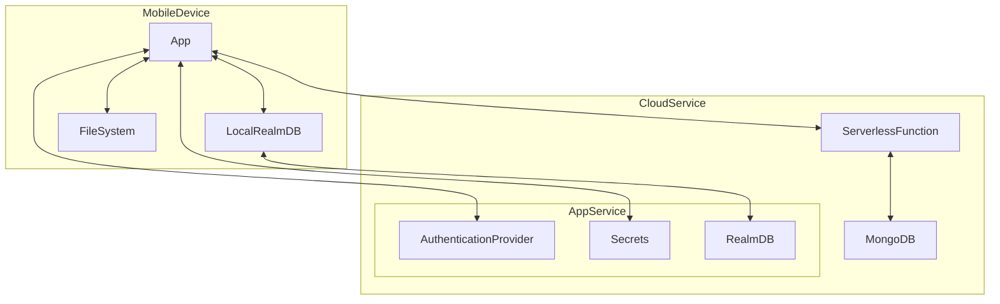

# film_freak

This is based on my prototype (https://github.com/zorrokid/film_freak) and [Realm Flutter](https://realm.io/realm-flutter/) template app. 

## Architecture

## Update model schema 

flutter pub run realm generate

## Some realm specific notes

["In your schema you must use the MapTo("_id") annotation with your primary key in the RealmModel to successfully sync your Object Schema with App Services."](https://www.mongodb.com/docs/realm/sdk/flutter/model-data/define-realm-object-schema/)

["While Development Mode is on, App Services doesn't validate writes against your data model, allowing you to freely update your Realm Object Model."](https://www.mongodb.com/docs/atlas/app-services/sync/data-model/create-a-schema/)

["Synced realms do not have schema versions and automatically migrate objects to the latest schema. Synced realms only support non-breaking schema changes."](https://www.mongodb.com/docs/realm/sdk/flutter/model-data/update-realm-object-schema/#std-label-flutter-manually-migrate-schema)

[Updating synced schema](https://www.mongodb.com/docs/atlas/app-services/sync/data-model/update-schema/#std-label-synced-schema-overview)

["When you only make non-breaking changes to the server-side schema, no additional action is required. However, if you then try to apply these changes to your client object model, you may need to perform a migration. If the client device has an existing realm file, you must perform a migration."](https://www.mongodb.com/docs/atlas/app-services/sync/data-model/update-schema/#std-label-synced-schema-overview)

## Configuration

Ensure `assets/config/realm.json` exists and contains the following properties:

- **appId:** your Atlas App Services App ID.
- **baseUrl:** the App Services backend URL. This should be https://realm.mongodb.com in most cases.

Create a separate App Services App with Device Sync
enabled to use this client. You can find information about how to do this
in the Atlas App Services documentation page:
[Template Apps -> Create a Template App](https://www.mongodb.com/docs/atlas/app-services/reference/template-apps/#create-a-template-app)

Once you have created the App Services App, replace any value in this client's
`appId` field with your App Services App ID. For help finding this ID, refer
to: [Find Your Project or App Id](https://www.mongodb.com/docs/atlas/app-services/reference/find-your-project-or-app-id/)
